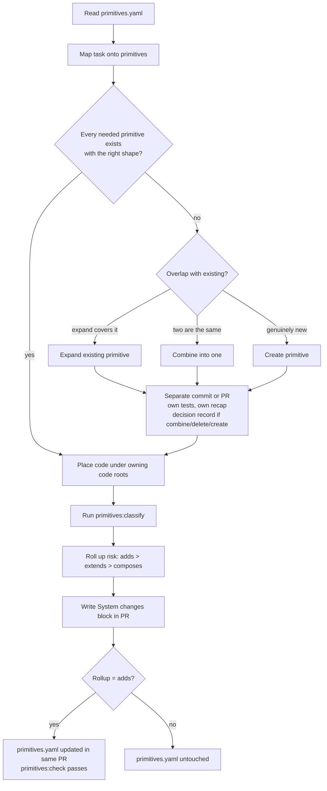

# Primitives system: bootstrap and operating instructions

You are an agent working in this repository. Follow this document exactly. It defines what a primitive is, how to inventory the ones this codebase already has, how every agent must use that inventory, and the narrow conditions under which the inventory may change.

---

## 0. Definitions

**Primitive** - the smallest unit of meaning this system exposes. It is named, has one owner (a code root), and composes with other primitives without re-implementing them. A primitive is a *capability*, not a feature. "Orders" is a primitive; "cancel order from the mobile checkout page" is a feature that composes primitives.

**Primitive areas** (use these as `group` ids unless the codebase clearly needs others):

| group     | what belongs here                                                        | symptom when missing                                  |
| --------- | ------------------------------------------------------------------------ | ----------------------------------------------------- |
| `ui`      | components, design tokens, layout/spacing/typography systems             | inconsistent colours, spacing, duplicate widgets      |
| `api`     | resources and the verbs on them, handlers, service entrypoints           | duplicated business logic, logic drift between callers|
| `data`    | entities, relationships, schemas, migrations, repositories               | ad-hoc shapes, guessed relationships                  |
| `infra`   | deploy targets, scheduling/cron, storage, queues, secrets handling, config| agents guessing at environment, dangerous one-offs    |
| `tools`   | callable scripts, CLIs, codegen, test harnesses, dev commands            | agents writing throwaway bash instead of using a tool |
| `workflow`| retry, idempotency, jobs, events/subscriptions, long-running processes   | hand-rolled retry loops, bespoke state machines       |
| `auth`    | identity, sessions, tokens, roles/permissions, audit trail               | god-mode access paths, no audit, inline permission checks |
| `surfaces`| entrypoints: web app, public API, worker, CLI, webhook ingress           | unclear where a request enters the system             |

**Invariant** - a rule that spans primitives and must hold everywhere (e.g. "tenant id scopes every read and write", "raw secrets never reach logs or prompts").

**The four verbs** applied to primitives over the life of the project:

- **create** - a genuinely new unit of meaning with no existing home
- **combine** - two or more primitives are the same thing in different shapes; merge into one
- **delete** - nothing uses it; remove it to shrink the action space
- **expand** - an existing primitive gains a capability so a near-duplicate is unnecessary

Default preference order when a need appears: **reuse > expand > combine > create**. Delete whenever something is unused.

**The one rule**: when a primitive you need is missing, do **not** work around it. Workarounds are local, brittle, duplicated and unauditable. Stop, make the primitive change as its own unit of work, then continue.

---

## 1. Mode detection

```
if docs/architecture/primitives.yaml exists  -> OPERATE mode (section 3)
else                                        -> BOOTSTRAP mode (section 2)
```

Adjust the path only if this repo already keeps architecture docs elsewhere; then use that location consistently everywhere in this document.

---

## 2. BOOTSTRAP mode: generate `primitives.yaml`

Complete all steps. Produce no feature code in this mode.

### 2.1 Survey

Read, do not skim:

- root manifests and workspace config (package/build/workspace files, task runners, CI workflows)
- every entrypoint (servers, workers, CLIs, scheduled handlers, webhook receivers)
- routers, controllers, handlers, resolvers, service layers
- schemas, models, migrations, ORM definitions, type definitions for domain entities
- component libraries, design tokens, theme/style systems
- infra definitions (deploy configs, container/k8s/serverless manifests, env var handling, secrets access)
- scripts and tooling directories
- auth, session, permission, audit code
- existing architecture or decision docs

Record for each candidate: a one-line meaning, its code root(s), and every other place that re-implements the same idea.

### 2.2 Reduce to primitives

Apply these tests to the candidate list:

- **Duplicate test** - if the same idea is implemented in 2+ places, that is *one* primitive candidate with a duplication problem. Record the duplicates in the audit (2.6), not as separate primitives.
- **Guess test** - if an agent arriving cold would have to guess how this is done (how to schedule work, how to check a permission, how to add a column), that is a primitive. If it is already obvious and singular, it still goes in the map so the classifier can own the paths.
- **Feature test** - if the name describes a user-facing feature rather than a reusable capability, it is not a primitive. Find the primitives it composes.
- **Size test** - target 15-40 primitives. Over 40 means you are listing features or files. Under 10 for a non-trivial codebase means you are hiding meaning.

### 2.3 Write `docs/architecture/primitives.yaml`

Use this exact shape. The comment header is part of the file; keep it.

```yaml
# System primitives map (taxonomy)
#
# Stable vocabulary for agents and reviewers. This is NOT a feature changelog
# and NOT the source of truth for behaviour - code is the truth for
# implementation and the linked docs hold detail.
#
# Risk labels used in PR recaps:
#   composes - wires existing primitives without changing them
#   extends  - changes a primitive's behaviour, shape, or contract
#   adds     - introduces a new primitive (update this file in the same PR)
#
# Update this file ONLY when adding, removing, or materially reshaping a
# primitive (id, name, group, code roots, or meaning). Do NOT edit `summary`
# for ordinary feature work.
#
# `code` entries are coarse ownership roots matched by longest prefix.
# Prefer directories (trailing /) over file lists. Keep the map small.

version: 1

groups:
  - id: surfaces
    name: Entry points
  - id: auth
    name: Identity & auth
  # ... only groups actually used

primitives:
  - id: kebab-case-id
    group: one-of-groups-above
    name: Short human name
    summary: One line, max 120 chars, present tense, what it IS and what it owns.
    code:
      - src/some/dir/
      - src/other/prefix-        # prefix match: matches prefix-*.ts etc.
    docs:
      - docs/architecture/some-doc.md   # optional; every path must exist

invariants:
  - id: kebab-case-id
    summary: One line, max 120 chars, stated as a rule that must hold.
    docs:
      - docs/architecture/some-doc.md
```

Entry rules:

- `id` unique, kebab-case, stable; renaming an id is a reshaping and needs a decision record (section 4.3)
- `name` five words or fewer
- `summary` single line, 120 characters max, describes ownership and meaning, never recent changes
- `code` 1-6 roots; directories preferred; a path may belong to several primitives but longest prefix wins in classification
- `docs` optional, but every listed path must exist as a file
- order primitives by group, in the order groups are declared, with a comment separator per group

### 2.4 Write the check and classify tooling

Implement in the language and runtime this repo already uses for tooling. Add no dependency unless the repo has no YAML parser at all; then vendor a minimal one that handles only this file's subset (scalars, lists of strings, lists of maps).

**`primitives:check`** must fail (non-zero) if any of:

- the file does not parse
- a primitive or invariant `id` is duplicated
- a primitive lacks `name`, `group`, or `summary`
- `group` is not declared under `groups`
- any `summary` contains a newline or exceeds 120 characters
- any `docs` path does not exist or is not a file
- any `code` root does not exist on disk (a directory root must be a directory; a prefix root must match at least one entry in its parent directory)

On success print: `primitives map ok: N primitives, M invariants`.

**`primitives:classify`** takes changed paths (from `git diff --name-only <base>...<head>` by default, or stdin) and prints each path's owning primitive using longest-prefix match over all `code` roots, then an `Unmatched` list. Support `--json` output with `{ matched: [{ id, group, root, files }], unmatched: [] }`.

Register both as named tasks in the repo's task runner (e.g. `npm run primitives:check`, `make primitives-check`, `just primitives-check`).

### 2.5 Wire the gates

- Add `primitives:check` to the single authoritative local validation command (whatever "run everything before you push" is called here). If none exists, create `validate` and put it there.
- Add `primitives:check` as a CI step.
- Add this section to the PR template (create the template if absent):

  ```markdown
  ## System changes

  <!-- Primitives touched, risk rollup (composes | extends | adds), invariants
       affected. Run primitives:classify. If rollup is `adds`, primitives.yaml
       changes in this PR. -->
  ```

- Add the agent instruction block from section 6 to the repo's agent instruction file (`AGENTS.md`, `CLAUDE.md`, `.cursor/rules`, or equivalent; create `AGENTS.md` if none exists). Keep that file a map, not the docs.
- Create `docs/architecture/decisions/0000-template.md` with the content in section 4.3.

### 2.6 Write the audit report (do not act on it)

Write `docs/architecture/primitives-audit.md` answering, from what you saw in 2.1 and 2.2:

- **Missing** - primitives agents would currently have to guess at or hand-roll
- **Duplicated** - the same idea implemented in multiple places (list every location)
- **Overlapping** - pairs of primitives that are nearly the same thing; recommend which absorbs which
- **Unused or near-unused** - candidates for deletion
- **Too rigid** - primitives that encode one use case where a smaller, more general primitive plus composition would serve (prefer emitting events and letting consumers subscribe over bespoke handlers)
- **Invariants observed but unenforced** - rules the code assumes but nothing checks

For each item give: verb (create / combine / delete / expand), affected ids, one-paragraph rationale, estimated blast radius (files, callers). Rank by how much agent guesswork each removes.

This report is input to a human decision. The human owns product direction and decides which items proceed. Do not implement any of them in BOOTSTRAP mode.

### 2.7 Validate and present

Run `primitives:check`. Run `primitives:classify` over the whole tree (`git ls-files` on stdin) and confirm the `Unmatched` list contains only tests, fixtures, tooling config, generated output, and vendored code. Source files in `Unmatched` mean a primitive is missing from the map or the code is an undocumented workaround: resolve before finishing.

Present: the yaml, the audit, the list of files added or changed, and the gate commands.

---

## 3. OPERATE mode: every task, every agent



### 3.1 Before writing code

1. Read `docs/architecture/primitives.yaml` in full.
2. Write down (in your plan or PR draft) which primitive ids the task **composes**, which it **extends**, and whether any is **missing**.
3. For each invariant, state whether the task can violate it. If yes, state how you preserve it.
4. If a primitive is missing, or two existing ones overlap in a way the task exposes: **stop feature work**. Decide expand / combine / create using the preference order in section 0. Do that change first as its own commit or PR with its own tests and its own recap. Then return to the feature.

### 3.2 While writing code

- Put new code under the `code` root of the primitive that owns the meaning. If no root fits, you have a missing primitive (go to 3.1 step 4), not a new directory.
- Never create a second implementation of anything already in the map. Search the owning root before writing.
- Never write a one-off script for something a `tools` primitive already does. Extend the tool.
- Never invent a data shape outside the `data` primitives. Add to the schema through the owning primitive.
- Never touch deploy, storage, secrets, or scheduling except through the `infra` primitives.
- Never inline a permission or identity check; use the `auth` primitive's API.
- Prefer inversion of control: when a new behaviour is needed on an existing event, emit or subscribe rather than adding a rigid special-case handler.

### 3.3 After writing code

1. Run `primitives:classify` against your base branch.
2. Roll up risk: `adds` if any new map entry, else `extends` if you changed any primitive's behaviour, shape, or contract, else `composes`.
3. Fill the **System changes** block in the PR with this exact shape:

   ```markdown
   <!-- system-recap:start -->
   **Rollup:** composes | extends | adds

   | primitive | risk | what changed |
   | --- | --- | --- |
   | `id` | composes / extends / adds | one line |

   **Invariants touched:** none | `id` - how preserved

   ```mermaid
   sequenceDiagram
     %% one diagram showing the changed path through the primitives
   ```
   <!-- system-recap:end -->
   ```

4. If rollup is `adds`, `primitives.yaml` is changed in this PR and `primitives:check` passes.
5. Any source path in `Unmatched` must be either added to an existing root (if it belongs there) or justified in the recap as tooling/test/fixture.

---

## 4. Update policy: change `primitives.yaml` only when absolutely necessary

### 4.1 Update when, and only when

- a new primitive `id` is introduced (**create**)
- an `id` is removed (**delete**, or the absorbed side of **combine**)
- the *meaning* of a primitive changes such that its `name` or `summary` is now false (**expand** that changes what it is, or **combine**)
- a `code` root moves or splits so that `primitives:classify` would misattribute or fail to match the primitive's files
- an invariant is introduced or retired

### 4.2 Do not update for

- feature work inside an existing primitive
- adding files under an existing `code` root
- refactors that keep files under the same root
- tests, fixtures, docs-only changes
- rewording a `summary` that is still true
- recording what changed recently (that is the PR and the docs, not the map)

**Litmus test** - would an agent reading the map, or the classifier reading the roots, now produce a wrong answer? If no, do not touch the file.

### 4.3 Decision records for combine, delete, and declined creates

Any **combine**, any **delete**, and any case where a requested new primitive is **declined** because an existing one covers it, gets a decision record at `docs/architecture/decisions/NNNN-short-slug.md` using this template:

```markdown
# NNNN: Short decision title

- **Status:** accepted <!-- accepted | superseded by [NNNN](./NNNN-slug.md) -->
- **Date:** YYYY-MM-DD

## Context

What situation forced the decision. System state and constraints, with links to
code or docs. Written after the decision, not as a design brief.

## Decision

One or two sentences. Usually a product-shaped no (we will not build X) or a
merge (X and Y become Z). Name the primitive that covers the need.

## Consequences

What stays simple, what gets harder, and the **revisit-if**: the concrete
condition that reopens this.
```

Do not write a decision record for a layout tweak, a library choice already encoded in code, or merely because a PR shipped. A plain **create** needs no record; the `adds` recap and the new yaml entry are the record.

### 4.4 Deleting safely

1. Confirm no callers (search all roots, including tests and tooling).
2. Write the decision record with the absorbing primitive named.
3. Remove the code and the yaml entry in the same PR, or, if a drain period is needed, add `# RETIRING - see decisions/NNNN` above the entry and remove it in the follow-up PR that drops the code. Never leave a retired entry without that marker.

---

## 5. Enforcement summary

| gate                  | where it runs                 | fails on                                        |
| --------------------- | ----------------------------- | ----------------------------------------------- |
| `primitives:check`    | local validate, CI            | malformed map, missing paths, long summaries    |
| `primitives:classify` | agent, before PR              | informs recap; unmatched source paths need action |
| PR template section   | PR review                     | missing recap on non-trivial change             |
| Decision records      | PR review                     | combine/delete/declined-create without a record |

---

## 6. Block to add to the repo's agent instruction file

Copy verbatim into `AGENTS.md` (or equivalent):

```markdown
## Primitives

`docs/architecture/primitives.yaml` is the vocabulary of this system. Read it
before any task. Map the task onto primitive ids: which it composes, which it
extends, which is missing.

- A missing primitive is never worked around. Stop, add or expand it as a
  separate change with its own tests, then continue.
- Prefer reuse > expand > combine > create. Delete what is unused.
- New code lives under the owning primitive's `code` root. No new top-level
  directories without a new map entry.
- Before PR: run `primitives:classify`, roll up risk (adds > extends >
  composes), fill the **System changes** block. `adds` means the yaml changes in
  the same PR and `primitives:check` passes.
- Edit `primitives.yaml` only for new/removed ids, changed meaning, moved code
  roots, or invariant changes. Never for feature work or summary polish.
- Combine, delete, and declined-create decisions get a record in
  `docs/architecture/decisions/`.
```

---

## 7. Begin

Run mode detection (section 1) now and proceed. State which mode you are in as your first line of output.
