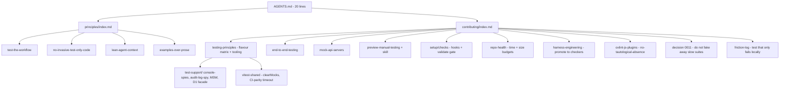

# Prompt: make this repo's tests good and keep them good

Paste everything below the `---` line into your agent (Claude Code, Cursor, Codex, etc.) at the root of any repo. Detects whether the repo is new or existing and does the right thing for each.

Companion: `optimise-agent-context.md` (from the "Optimizing agent files for better context" chat, 6 Oct 2026) plus `optimise-agent-context-addendum.md` restructure `AGENTS.md` / `CLAUDE.md` into a router. Run those first on a repo whose agent file is bloated; this prompt only needs the docs index link to exist.

Paths below assume `docs/contributing/` and `docs/principles/`. If the repo already has a `docs/agent/` tree from the companion, write the same files there instead and keep the filenames.

## Where this came from - kody's testing doc graph

Scanned every file under `docs/`, `.agents/skills/`, `tools/oxlint/`, `packages/worker/src/test-support/` and the Vitest configs in `kentcdodds/kody`. Testing knowledge is spread across 20+ small files behind a 20-line `AGENTS.md`:

---

You are making this repository's testing as good as it can be and keeping it that way. Two outcomes:

1. The code and test suite are improved now: harness gaps filled, bad tests fixed or removed, production test-seams removed, misclassified tests moved to the cheapest flavour that can falsify them.
2. Every future agent session writes small, behaviour-focused, high-value tests, never leaks test-only code into prod, never games the gate, and loads only the context it needs.

Work directly in the repo. Do not ask questions you can answer by reading it. Make changes in small, independently-revertible commits and run the test suite after each batch.

## 0. Rules for everything you write

- Docs: present tense; describe how the system works today; no "now we", "previously", "no longer".
- Examples over prose. Each principle page = one real example from THIS repo + a few rules, 20-40 lines.
- Prefer a checker over a should-list. If lint, types, or a CI script can reject it, add the check and have the doc point at it. A rule that would need control-flow or cross-file guessing is a one-line failure-mode note, not a half-check.
- Every path, command, helper, suffix you write must exist. Verify by reading the repo.
- One topic per page. Do not restate a rule in two files; link.

## 1. Detect mode and discover

Read the repo and classify:

- **NEW**: no test runner configured, or fewer than ~5 test files. Go to step 2, then 4 onward.
- **EXISTING**: a working test suite. Go to step 3, then 4 onward.

In both cases record: package manager, language(s), runner(s), test naming, local/CI test commands, the single validate-style gate if any, git hooks, CI jobs, existing helpers/factories, setup files, mock reset config, console guards, fakes/mock servers, in-memory stand-ins for DB/platform bindings, E2E setup, preview/manual-testing practice, and any `AGENTS.md`/`CLAUDE.md`/`.cursor/rules`/`copilot-instructions.md`.

## 2. NEW repo: bootstrap the harness

Pick the idiomatic runner for the stack and set up, in this order:

1. **Runner config** with: flat `test()` style supported; mocks auto-reset between tests; one shared test timeout sized for CI; a parity flag (`CI=1`-style) so local hooks and CI compute the same budgets. Separate projects/flavours by filename suffix (e.g. `*.unit.test.*`, `*.integration.test.*`, E2E dir) so each runs with its own command.
2. **`test-support/`** (or stack equivalent) containing:
   - console guard: unexpected `console.error`/`console.warn` fail the test; `info`/`debug` silenced; exported spies; `silenceExpected*([...])` helpers that allowlist exact messages and fail on anything else.
   - a shared spy for any fire-and-forget side-effect sink the app has or will have (audit log, metrics), wired in setup, with a documented opt-out.
   - network-edge faking (MSW or equivalent) with a node server and, if relevant, a runtime server.
   - in-memory stand-ins for the database and platform bindings used by the unit flavour.
   - factory helpers that return ready-to-run objects (`createUser()`, `createRequest()`), explicitly imported.
3. **One exemplary workflow test** per flavour, using the helpers, with inline setup and several assertions along one journey. These are the examples the docs will cite.
4. **E2E** only if the product has a UI: runner installed, own local server, one happy-path journey, role/label locators.
5. **Gate**: a `validate` script that runs format-check, lint, typecheck, every test flavour, and the checks from step 6 in parallel and reports every failure; `validate:fix` for mutating fixes; pre-commit (format + lint-fix + typecheck for code diffs; docs-only diffs skip); pre-push (unit + integration with the parity flag; docs-only skips; E2E stays in validate/CI); CI jobs mirroring validate.
6. Then continue at step 4.

## 3. EXISTING repo: audit and remediate

### 3a. Audit

Produce a table of findings, each with file, count, and the fix category below. Look for:

| Smell | How to find it |
| --- | --- |
| Prod test seams | `NODE_ENV`/`VITEST`/`isTest` branches in non-test source; exports matching `*ForTests`, `__testOnly*`, `_reset*`; params/options only tests pass; test-only env vars or routes; fakes in the prod bundle |
| Tautological tests | `expect(f(CONST)).toBe(...)` where `f` reads `CONST`; `not.toContain`/`not.toHaveTextContent` on multi-word prose that appears in no non-test source file; tests asserting a type, default, or that a constant equals itself |
| Copy-pinning tests | `toContain`/snapshots on descriptions, hints, warnings, labels, error prose |
| Hidden setup | `describe` nesting, `beforeEach`/`afterEach`, module-level mutable fixtures |
| Over-mocking | the unit under test is mocked; only mock calls are asserted; prod HTTP clients stubbed inside prod code instead of at the network edge |
| Silenced output | `console.error = () => {}`, `vi.spyOn(console, 'error').mockImplementation(() => {})` with no assertion, global `silent: true` |
| Misclassified flavour | integration/E2E tests that never touch real bindings or a browser; unit tests that `fetch` the internet |
| Gate gaming | `.skip`, `.only`, `--no-verify`, shortened timeouts, disabled isolation, `retries` on unit tests, tests deleted in recent history |
| Harness gaps | no console guard; no mock reset; no network-edge faking; no factories; no CI-parity timeout; no single validate gate; hooks missing |
| Oversized files | test files over ~2000 lines |
| Slow jobs | CI test jobs with no wall-clock budget, or budgets being met by skipping |

### 3b. Remediate, in this order, one commit per batch, suite green after each

1. **Harness gaps** - add the missing `test-support/` pieces from step 2.2 and the runner config from 2.1. Wire the console guard in but do not yet fail on existing noise: run the suite, collect the exact messages, then either assert on them where they are part of a contract or allowlist them per test with `silenceExpected*`. No blanket silencing survives.
2. **Gate gaming** - remove `.only`; convert `.skip` to either a working test or a deletion with a one-line reason in the commit; restore isolation and CI timeouts; drop unit-test `retries`. Any test that only fails locally gets a friction/issue entry with repro, not a skip.
3. **Prod test seams** - for each: route the test through a public interface, a network-edge fake, or a real local boundary, then delete the seam. If one cannot be removed in this change, open an issue naming the seam and the replacement, and add a lint rule so no new ones appear.
4. **Tautological and copy-pinning tests** - delete them. If the behaviour behind a copy-pin matters, add the behavioural assertion to the nearest workflow test instead.
5. **Misclassified flavour** - rename/move to the cheapest flavour that can falsify the behaviour. Swap real-binding reads for spies/facades where the unit flavour is now correct.
6. **Hidden setup and over-mocking** - flatten the worst files: inline `beforeEach` into each `test`, remove `describe`, merge tiny tests that share one setup into one workflow test, replace in-prod stubs with network-edge fakes. Do the files you already touched plus the five worst offenders by count; list the rest as follow-ups. Do not churn files you have no other reason to open.
7. **Oversized files** - split by workflow, or shrink by merging tiny tests. Add the remaining oversized files to a shrink-only allowlist (step 6).
8. **Coverage gaps** - for each user-critical flow with no test, add ONE workflow test in the cheapest flavour. Do not add more than that.

Every deletion or merge is behaviour-preserving: before removing a test, say in the commit what still falsifies that behaviour, or why nothing needs to.

## 4. Write the docs

### `docs/principles/index.md`
Table `Principle | When to open it`, one row per page below.

### `docs/principles/test-the-workflow.md`
Opening: one test is one workflow - setup, actions, and the assertions that prove it. An assertion needs an oracle the production code does not share. Example: a real tautological assertion you found or fixed, and the fixed version. Rules: flat `test()`, inline setup, no `describe`/`beforeEach`/shared state; no pinning constants, re-implementing the helper, or checking what types guarantee; absence assertions only on a live path that could still show the thing; high bar, unit for logic, few E2E, offline.

### `docs/principles/no-invasive-test-only-code.md`
Opening: prod must not carry invasive test-only seams; if the tests vanished, prod would not keep the code. Violations: env-branches that only change behaviour under test; `*ForTests` exports; test-only params/DI seams; fakes in the bundle; test-only env vars, routes, timing hooks. Prefer: public interfaces; real boundaries (local service, runtime emulator, network-edge mock, repo mock server); fixtures in test files or `test-support/`. Not violations: config prod also uses; real DI with a prod purpose; graceful degradation prod also needs. The test: would prod keep this if every test were deleted? Append the seams left as follow-ups.

### `docs/principles/examples-over-prose.md`
One example matching current code; multi-step procedures become scripts; a page keeps when / command / failure.

### `docs/contributing/testing-principles.md` (repo-specific)
- Opening: small readable suites, explicit setup, minimal magic; each test follows a meaningful workflow end-to-end.
- **Flavour matrix**: `Flavour / command | Use when | Avoid when`, one row per real flavour; rule: lightest flavour that can falsify; one feature shown at two levels; note remaining misclassifications and say to fix them only when already editing that area.
- **Principles**: fewer longer tests; manual tester's script; never split one flow for one-assertion-per-test; flat files; inline setup; no shared mutable state; don't test types; cleanup patterns only with real cleanup; factories not globals; names state intent and outcome; offline; high bar, higher for slow flavours; E2E for a tiny set of happy paths; intermediate states inside the workflow; no regression test per bug; no `toContain` on prose; no pinning configuration copy; exact commands and pitfalls.
- **Harness**: how the console guard, side-effect spies, network-edge fakes, infra stand-ins, mock reset, and timeout/parity flag work and where they live.
- **Suite speed and gaming** (verbatim, names adapted): slow suites are fixed by reclassifying, never by disabling isolation, global warmups, `--no-verify`, shorter timeouts, or `.skip`; wall-clock budgets fail CI and are never met by deleting tests; a test that only fails locally is filed, not bypassed; big test files are on a shrink-only allowlist.
- **Agent anti-patterns** (verbatim): a test per parameter/branch; re-asserting a type, default, or constant; mocking the thing under test; snapshot/`toContain` on prose; "for coverage" with no plausible failure; E2E for what a unit test falsifies in ms; `describe`+`beforeEach` hiding dependencies; a new export/env branch/param in prod only so the test can reach something; blanket console silencing. If in doubt, don't add it; extend the nearest workflow test.
- **Examples**: the two exemplary tests from step 2.3 / 3b, linked by path.

### Conditional docs
- `docs/contributing/end-to-end-testing.md` if a browser suite exists: goals, what to test, bar (default: don't), structure, role/label/placeholder locators, realistic fake data, UI-result assertions with no fixed sleeps, own local server never a shared preview, exact commands.
- `docs/contributing/mock-api-servers.md` if third-party APIs exist: one mock per service mirroring the real shape, durable per-mock state, `/__mocks` inspection route, pointed at via the same env var prod uses.
- `docs/contributing/manual-testing.md` if previews/manual QA exist: never a substitute for the gate; scripted assertions as a seeded non-admin user via the UI's own APIs; browser only when UI is under test; admin-only states proven locally with tests; evidence on the PR; risk ladder low/medium/high and what each requires.
- `docs/contributing/checks.md`: the gate ladder as it exists (pre-commit, pre-push, validate, CI, docs-only skips, parity flag). Describe, don't prescribe.
- For each existing architecture/feature doc you touch: one paragraph on how the feature behaves in tests when its prod dependencies are absent and which test file guards it. If the repo has model/LLM evals, give them their own doc and say they are not tests and not in the gate.

## 5. Wire into the agent entry file

- Create `docs/contributing/index.md` (or extend it) with a `## Testing` section listing every testing doc, `testing-principles.md` marked "read before writing or changing any test".
- Ensure the always-loaded agent file (`AGENTS.md`, `CLAUDE.md`, or whatever the repo uses) links `docs/contributing/index.md` and `docs/principles/index.md`. Add those two links if missing. Do not add testing rules to that file; they live in the docs.
- If that file is more than ~20 lines or repeats things discoverable from the repo, stop and say so; the companion `optimise-agent-context.md` handles it.

## 6. Enforcement

Add, wired into validate and CI:
- Markdown file-reference check: links to repo paths must exist.
- Test-file size ratchet: snapshot of currently-oversized files that may only shrink; new oversized files fail.
- Per-job wall-clock budget on unit/integration CI jobs, failing the job itself, if CI allows.
- Lint rules where the violation is visible in one file: no `*ForTests`/`__testOnly` exports outside tests; no `NODE_ENV === 'test'`-style branches outside tests; no `not.toContain`/`not.toHaveTextContent` on multi-word prose absent from all non-test source; no `.only`; no bare `console.error = () => {}` in tests. Export each rule's matching helpers so the rule is unit-tested without spawning the linter. Skip any rule that needs guessing; document the failure mode instead.

## 7. Verify and report

- Run validate / all test commands. Green.
- Re-open every doc as a fresh agent: every path, command, helper, link resolves.
- Report in this shape:
  - mode (NEW / EXISTING)
  - audit table from 3a with before/after counts per smell
  - commits made, each one line
  - tests deleted or merged, each with what still falsifies the behaviour
  - follow-ups opened (seams, files, flavours) with issue links
  - checks added
  - anything deliberately omitted because the repo did not need it
